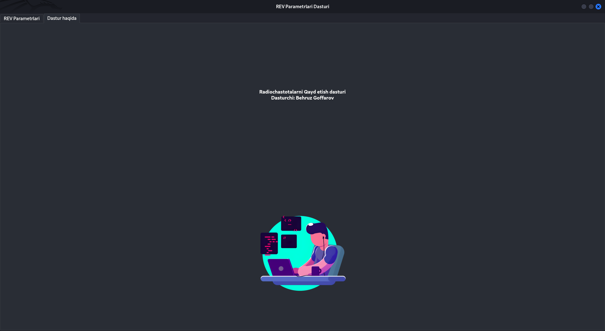

# REV Parametrlari Dasturi

**REV Parametrlari Dasturi** is a desktop application designed to manage and save parameters for radio frequency (REV) devices. It allows users to enter various REV-related data, save it to a local SQLite database, and export the data to an Excel file.

## Features

- **System Info Check**: Displays system information including IP address and file path.
- **Data Input**: Allows users to input and save parameters related to REV devices.
- **Database Management**: Data is stored in an SQLite database, with an option to export to an Excel file.
- **Customizable Fields**: The application includes various fields such as frequency, signal level, modulation type, etc.
- **User Interface**: A user-friendly interface created with PyQt5 for desktop usage.

## Installation

## Full installation


### Linux (Ubuntu / Debian-based)

1. Ensure that Python 3 is installed on your system. If not, install it using the following command:

    ```bash
    sudo apt update
    sudo apt install python3 python3-pip
    ```

2. Install required dependencies:

    ```bash
    sudo apt install python3-pyqt5 python3-pandas sqlite3
    ```

3. Clone the repository to your local machine:

    ```bash
    git clone https://github.com/XizmatHubRec/Frequency-recorder.git
    cd Frequency-recorder
    chmod +x setup.sh
    ./setup.sh
    ```


4. Install the Python dependencies using pip:

    ```bash
    pip install -r requirements.txt
    ```

5. Run the program:

    ```bash
    python3 main.py
    ```

### Arch Linux

1. Install Python 3 if not installed:

    ```bash
    sudo pacman -S python python-pip
    ```

2. Install required dependencies:

    ```bash
    sudo pacman -S python-pyqt5 python-pandas sqlite
    ```

3. Clone the repository to your local machine:

    ```bash
    git clone https://github.com/XizmatHubRec/Frequency-recorder.git
    cd Frequency-recorder
    chmod +x setup.sh
    ./setup.sh
    ```

4. Install the Python dependencies using pip:

    ```bash
    pip install -r requirements.txt
    ```

5. Run the program:

    ```bash
    python3 main.py
    ```

### Windows

1. Ensure that Python 3 is installed on your system. Download it from [Python's official website](https://www.python.org/downloads/).

2. Install required dependencies:

    ```bash
    pip install pyqt5 pandas sqlite3
    ```

3. Clone the repository to your local machine:

    ```bash
    git clone https://github.com/XizmatHubRec/Frequency-recorder.git
    cd Frequency-recorder
    ```

4. Install the Python dependencies using pip:

    ```bash
    pip install -r requirements.txt
    ```

5. Run the program:

    ```bash
    python main.py
    ```

## Usage

Once the application is running, you will be presented with two main sections:

1. **REV Parametrlari (Main Tab)**: Here, you can input various REV parameters such as frequency, signal level, modulation type, etc. Once filled, you can save the data to the SQLite database or export it to an Excel file.

2. **About Tab**: This section provides details about the application, including the developer's name and a profile picture.

To save the entered data, click the "Saqlash" (Save) button. You can also export the data to an Excel file by clicking the "Excel Yuklab Olish" (Export to Excel) button.

## Screenshots

Here are some screenshots of the application:




## Database Structure

The data is stored in an SQLite database named `rev_data.db`. The `parameters` table contains the following columns:

- `id`: Auto-incremented ID.
- `rev_name`: Name of the REV device.
- `serial_number`: Serial number of the REV device.
- `frequency`: Frequency value.
- `frequency_unit`: Unit of frequency (e.g., Hz, kHz).
- `signal_level`: Signal level value.
- `signal_unit`: Unit of signal level (e.g., dBm, dB).
- `frequency_stability`: Frequency stability value.
- `modulation_type`: Modulation type used (e.g., AM, FM).
- `bandwidth`: Bandwidth value.
- `bandwidth_unit`: Unit of bandwidth.
- `measured_location_lat`: Latitude of the measured location.
- `measured_location_lon`: Longitude of the measured location.
- `installed_location_lat`: Latitude of the installed location.
- `installed_location_lon`: Longitude of the installed location.
- `protocol_number`: Protocol number.
- `engineer_name`: Name of the engineer who performed the measurement.
- `measurement_date`: Date of the measurement.
- `created_at`: Timestamp of when the data was created.

## Contributing

If you'd like to contribute to the project, feel free to fork the repository, create a branch, and submit a pull request. Any improvements, bug fixes, or feature additions are welcome.

## License

This project is licensed under the MIT License - see the [LICENSE](LICENSE) file for details.

## Developer Information

This program was developed by **Behruz Goffarov**, a skilled freelance developer with expertise in web development, cybersecurity, Android, iOS, system engineering, and AI.

---

Thank you for using REV Parametrlari Dasturi. For any questions or feedback, feel free to open an issue or contact me.
